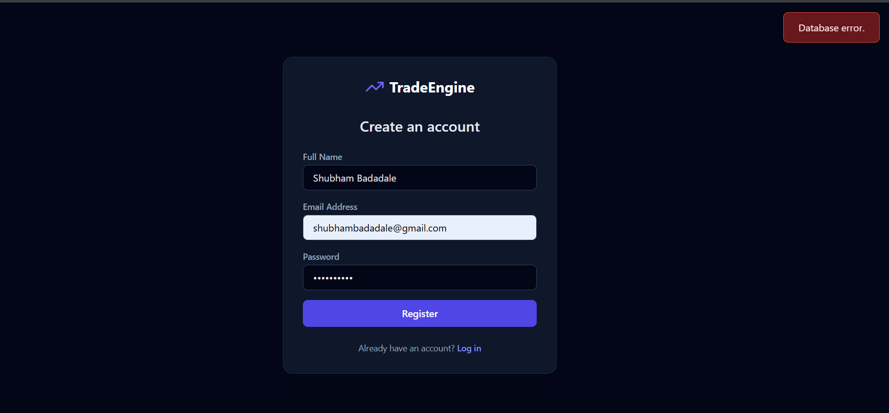
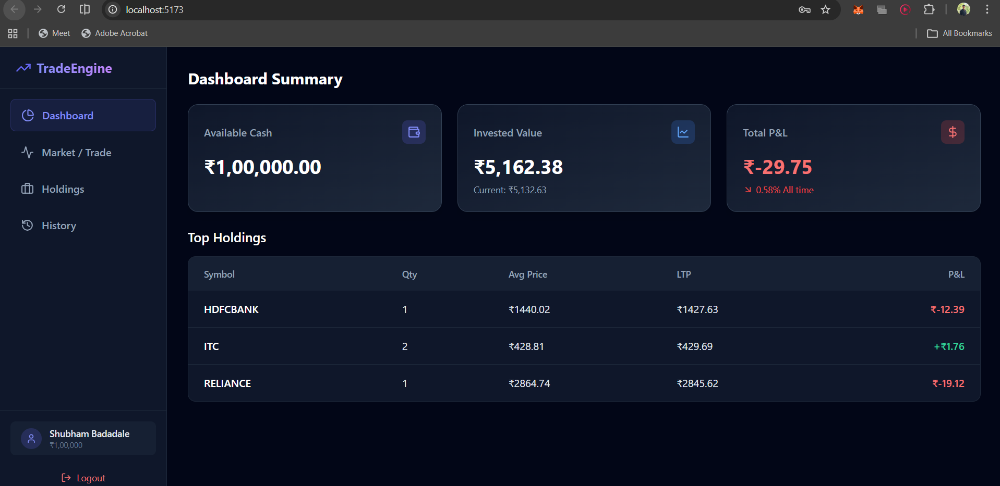
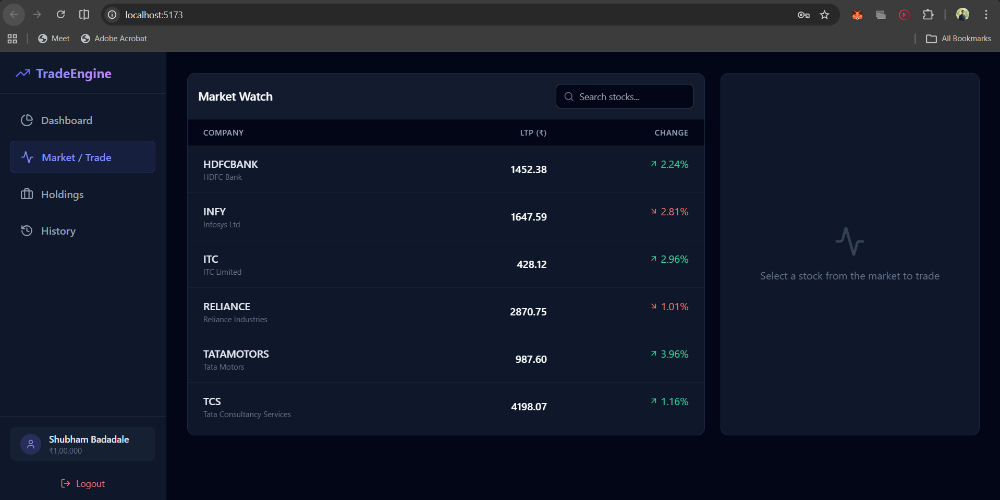
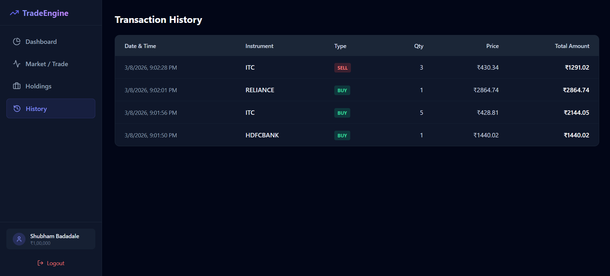

# TradeEngine – Stock Trading Simulator (MERN)

TradeEngine is a full-stack stock trading simulator built with the MERN stack.
It allows users to register, log in, view simulated market prices, and practice buying or selling stocks using virtual money.

The project is designed to demonstrate full-stack development skills: authentication, API design, database modeling, and a simple trading engine.

---

## Features

- User authentication with JWT (register and login)
- Simulated stock market with multiple companies
- Virtual balance for each user
- Buy and sell stocks
- Portfolio tracking
- Transaction history
- Automatic stock price fluctuations (simulated market)

---

## Features

### User Login

Users can securely login using JWT authentication.



---

### Stock Market Dashboard

Displays available stocks and prices.



---

### Buy / Sell Stocks

Users can trade stocks and update their portfolio.



---

### Portfolio Tracking

Shows owned stocks and profit/loss.



[](https://drive.google.com/file/d/1GUOfSg4hSiXtXXVX0kuZVkobu4AforGn/view?usp=drive_link)

## Tech Stack

Frontend

- React (Vite)
- Axios
- Tailwind CSS

Backend

- Node.js
- Express.js

Database

- MongoDB
- Mongoose

Authentication

- JSON Web Tokens (JWT)
- bcrypt for password hashing

---

## Project Structure

```
TradeEngine
│
├── backend
│   ├── models
│   │   ├── User.js
│   │   ├── Stock.js
│   │   ├── Portfolio.js
│   │   └── Transaction.js
│   │
│   ├── routes
│   ├── seedStocks.js
│   ├── server.js
│   └── package.json
│
├── frontend
│   ├── src
│   ├── public
│   └── package.json
│
└── README.md
```

---

## Installation & Setup

Clone the repository:

```
git clone https://github.com/yourusername/TradeEngine.git
cd TradeEngine
```

### Backend Setup

Navigate to the backend folder:

```
cd backend
npm install
```

Create a `.env` file inside `backend`:

```
MONGO_URI=mongodb://127.0.0.1:27017/trading_simulator
JWT_SECRET=your_secret_key
PORT=5000
```

Start the backend server:

```
node server.js
```

Seed the database with stock data:

```
node seedStocks.js
```

---

### Frontend Setup

Open a new terminal:

```
cd frontend
npm install
npm run dev
```

The frontend will run at:

```
http://localhost:5173
```

---

## API Endpoints

Authentication

```
POST /api/auth/register
POST /api/auth/login
```

Market

```
GET /api/stocks
```

User

```
GET /api/user/profile
```

Trading

```
POST /api/trade/buy
POST /api/trade/sell
```

Portfolio

```
GET /api/portfolio
GET /api/transactions
```

---

## Future Improvements

- Real-time stock data using external APIs
- WebSocket-based live market updates
- Charts and technical indicators
- Deployment with Docker and cloud hosting

---

## Authors

Vivek Shitole
Yogeshvari Mandada
Srusti Shinde
Shubham Badadale

GitHub: https://github.com/ShubhamBadadale
